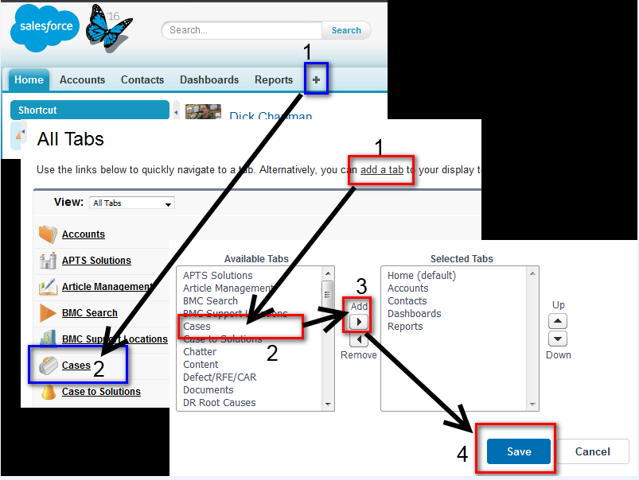
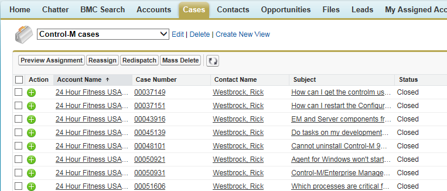
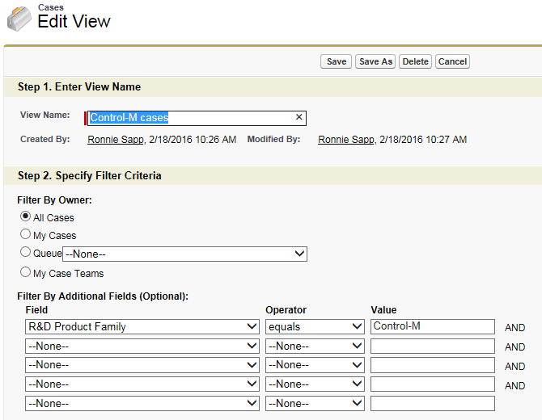
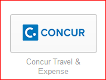
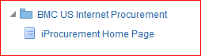

## BMC Internal

### BMC Contacts

| Contact | Phone Number  | Email Address |
|------------|--------------------------------------------|---|
| BMC Service Desk    | +1 (713) 918-4358      |email |
| BMC HR     | +1 (713) 918-4210  |email |
| BMC Support | +1 (713) 918 2950 | <customer_support@bmc.com> |

Other contacts are available [here](https://www.bmc.com/contacts-locations/united-states.html)

### Policies and Guidelines

For more information visit [BMC Policies and Guidelines](https://my-bmc.com/departments/legal_site/policies_and_guidelines/ )

### Benefits

#### PTO

Below are the numbers of days you are eligible for based on the number of service years.  Also included is the Daily Accrual for employees that have been with BMC for less than one year.

Also don’t forget as BMC employees we do get floating Holidays as per the BMC Holidays calendar.

Vacation time allows employees to utilize a defined amount of PTO for leave that is not covered in other types of leave. For example, vacation time can be used to handle personal business.

In the first partial calendar year of hire as a full-time BMC employee, an employee will accrue the pro-rata equivalent of 15 days per year, calculated on a daily basis (.041 days of vacation time per calendar day).  Beginning in the first full calendar year after your hire date, the following schedule applies:  

In the calendar year that an employee reaches the next service level (5 or 10 years),  the employee is eligible for the next level of vacation time.

| Years of Service | Annual Accrual   | Daily Accrual |
|------------|-----------------------|---------------------|
| 1 to 4    | 15 days      | 0.041 |
| 5 to 9     | 20 days  | 0.055 |
| 10 | 25 days (maximum) | 0.068 |

For more information visit [Paid Time Off - USA](https://my-bmc.com/resources/human_resources/_global_hr/_hr_and_benefits_usa/paid_time_off__usa)

#### BMC Holidays

For more information visit [Holidays - USA](https://my-bmc.com/resources/human_resources/_global_hr/_hr_and_benefits_usa/holidays_us)

### Requesting new TSO userid's via Remedy ticket

**From**: Krezer, Melvin  

**Sent**: Thursday, May 9, 2019 9:00 AM

REMINDER: Please be aware that this is a restricted communication (BMC Confidential) and is intended for BMC internal use only.  There are occasionally items included here which contain non-disclosure information regarding products or services offered by BMC or by our suppliers.  Do not forward this email to recipients who are not BMC employees.  If you are the owner of, or are responsible for email distribution lists, please insure that your lists include only recipients who are authorized to receive this information.

**Announcements**:  

1. **Requesting new TSO userid’s via Remedy ticket.**

Please enter requests for new TSO userids via Remedy ticket to “Mainframe Services”.  Do not submit requests through AccessBMC.  Provide the requested user’s first name, last name and middle initial, environment(s) needed (Side A/B, QAplex, Demo systems, etc.), and a userid or other person’s name to be used as a model.

Mainframe IT will create the TSO userids and notify the new user.  The new userids will be connected to AccessBMC and passwords will then be managed as usual through AccessBMC.

This is for new userids in TSO only, and does not apply to Windows userids for email, network access, etc.

Note about access from EM/GUI:  
There is an equivalence table that allows to connect EM/GUI usernames with TSO usernames  
For BMCA/BMCB the member is **BMCSCC.IOA.V9PRE.PARM(EMREQUSR)**  
To view use P (ISPF/PDF) 3 (utilities) 4. Dslist  
[For more information visit KA  316872](https://communities.bmc.com/docs/DOC-50028)

##BMC Support

### Product Questions

If you have a **product technical question** that you can’t find the answer to, ask your teammates and/or open a Support ticket. Support has a SME teams for all Control Modules and Add-on products. You can ask them any “point of information” type of questions by simply mailing it to CTM-SME-<product abbreviate>. To get a full list of SME groups simply enter ‘CTM-SME-‘ in the TO field of your email and then hit ^K.

If you have a **product direction type of question**, then send those to Product Management.

If you have a current product platform support question, use the Product Availability[Office1] /Capability Utility on our intranet home page. Updated for SPAC matrix tool on support page [here](https://customerapps.bmc.com/spac/o/welcome.html)

### Searching Customer Support Cases

In the past many of you used Remedy to look up customer cases.  As you are aware we have switched over to Service Cloud offering from SFDC.  You should now all have read access to the “Cases” tab.  You can view the tab by following the blue steps in the attached image, or add “Cases” to your tabs list by following the red steps.  After that you can customize your view by Cloning the default view, rename and then apply some filters to search for on Control-M cases, which is what I did.   If you encounter a problem, go to Chatter > Groups > Service Cloud @ BMC   and request for help.

My view after cloning default and filtering on “Control-M”

FYI – Here is what my filter looks like in case you are interested.  There might be others you would like to apply that might be better.  I just started to play with this.

### The AMIGO program

The AMIGO program is a free program from customer support to assist our customers in the planning process of Migrating from one version to another.
For more information visit the [Support Site](https://www.bmc.com/support/resources/amigo_program_overview.html)
To view information specific to Control-M click [here](https://bmcsites.force.com/casemgmt/sc_KnowledgeArticle?sfdcid=000011573)

### Mainframe Help Desk

**Demo System (BMCA/B LPARS) issue Reporting Guidelines**:

IT has recently resolved an issue that will allow us to open Help Desk tickets for the Mainframe IT group via an email.   If there is a need to open an issue with this group, you can send an email with the specifics of the issue to ‘Helpdesk@bmc.com’ and include the word ‘Mainframe’ in the subject line.

## Expenses

### Travel Policy

For more information visit [Travel and Expense Policy](https://my-bmc.com/download/departments/legal_site/policies_and_guidelines/corporate_policy_documents/travel_and_expense_policy/travel_and_expense_policypdf~2?attachment=0)

### Travel and Expense Systems

Both travel and expense reporting are done via the Concur application.  
Access Concur via Okta [here](https://bmc.okta.com/app/UserHome ), and look for the icon below:  

### NA Expenses
**Travel and Business Expense policy**

No per diems.  For meals you will expense out each meal and the total for the day will be reimbursed up to the $70 limit.

U.S. Employees traveling internationally will be reimbursed up to $100 per day for actual Meals & Entertainment expenses. If traveling within the U.S., this reimbursement is on expenses up to $70 per day. These reimbursements are not per diems, as they are only applied against incurred expenses. U.S. employees are no longer subject to per diems unless otherwise specified, such as part of a Consulting Services engagement (refer to Section 4.22).

**You have 30 days to submit your expenses**

### Correcting Policy Violations

Many expense reports that contain “Expense Violations” can be eliminated by your correct entry.
The 2 most common “expense violations” received are:

* Lodging  
* Car Rental

The situation:  

* You use the Amex credit card pull which contains the total amount of the bill.  If this is for 1 day only then generally there is not a problem.  The violation occurs when you have a multi-day charge (Lodging and/or Car Rental).  The default number of days for the total charge is 1 day.  The system will create a violation as being an excessive charge for 1 day based on BMC guidelines.

To correct:

* You must itemize the expense
* Change the “Daily Rate” to whatever the 1 day rate is, including taxes
* Change the “Number of Days” to the correct amount of days.
* Sometimes you may have to eat a penny to round things off.

## Internal Purchases

Oracle eBiz is the internal purchase system used for ordering office supplies, memory, non-BMC software, etc. You can access eBiz [here](https://ebiz.bmc.com/OA_HTML/AppsLocalLogin.jsp)   
1. Login with your ADPROD ID and Password  
2. Select  Internet Procurement as shown below:  

## PreSales internal

### Photo Uploading
**Uploading a photo is a requirement**  

Please upload your photo in all of the BMC locations listed below.  

**Skype for Business**

1. You will need to use one of the following browsers: Internet Explorer 10 or 11, Safari, Google Chrome or Firefox.

2. Go to [https://webmail.bmc.com](https://webmail.bmc.com)  
3. Click on the “Sprocket wheel (settings)
4. Click on “Options”
5. Click on “Edit information”.  You might need to scroll down the page a little to see it.
6. Click on “Change”
7. Browse to where your picture is located and upload.  

**Chatter**

1. [Log in to Chatter](https://bmcapps.my.salesforce.com/home/home.jsp), using your ADPROD username and password as your log-in credentials.
2. Click on your name in the upper left to go to your profile page.
3. If you do not have an existing photo: On your profile page, mouse over the space with the silhouette and click “Add photo.”
If you have an existing photo: On your profile page, mouse over your existing photo and click “Update.”
4. Click “Choose File” to navigate to your desired photo.
5. After the file has uploaded, drag the dotted cropping lines to include the full image and click “Save.”

**BMC Career Management site**

1. Access BMC Career Management via Okta [here](https://bmc.okta.com/app/UserHome ), and look for the icon: 
2. Login using your ADPROD username and password. – this step did not happen for me, just the access code sent to my mobile by SMS
3. Click on Goals
4. Click on the dropdown on the blank portrait and select “View Portrait”
5. Click on the silhouette above your job information. In the “Update Photo” window that pops up, browse to your desired photo.  
6. Click “Save and Close.”

## Cost Centers

**Cost Center Number**

* Sapp’s cost center number is 20739 
* Coppinger’s cost center number is 20292
* Ana/Jemma/Aimee cost center is 21079  

**Company Codes**

* Sapp & Coppinger – 5011 (BMC Software employees)
* Sapp – 5091 (for BMC Federal employees only)
