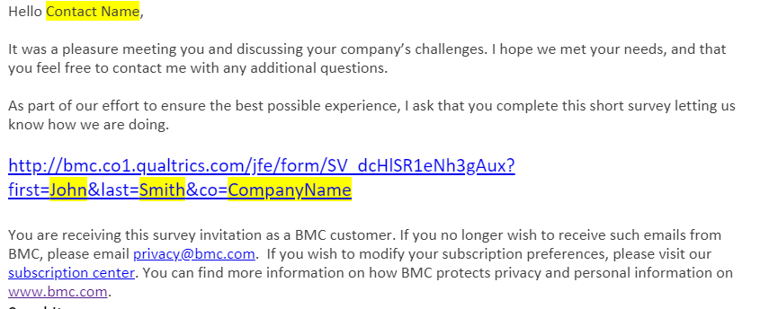

## PreSales General

### MBO Recording Requirements

| Deliverable | SalesForce Type  | Opportunity | SFDC Activity | Sesmic Document | SharePoint Survey | Notes|
|------------|--------------------------------------------|---|--|--|--|--|
|Account Planning SAAP PG activity | ESO PreSales Account Strategy | Client Opportunity or Account | Yes |Yes| | |
|Speaking at Marketing events |ESO PreSales Demand Gen/Pipeline Gen |PreSales Engagement Excellence Tracking (SFDC-510399) |Yes ||Yes | | |
|Support Partner training/enablement |ESO PreSales Partner Enablement |PreSales Engagement Excellence Tracking (SFDC-510399) |Yes || Yes| | |
|Customer Contact Programs activities|ESO PreSales Collaborative Value Review |PreSales Engagement Excellence Tracking (SFDC-510399) |Yes ||Yes |Subject line to start with CCP|
|White Papers/Competitive Docs |ESO PreSales Thought Leadership |PreSales Engagement Excellence Tracking (SFDC-510399) |Yes |Yes |Yes||
|CVCs/Value Cases |ESO PreSales Thought Leadership |PreSales Engagement Excellence Tracking (SFDC-510399) | Yes | Yes| Yes|||
|Surveys |ESO PreSales Administration |PreSales Engagement Excellence Tracking (SFDC-510399) |Yes ||Yes||
|Differentiated CoP content |ESO PreSales Thought Leadership |PreSales Engagement Excellence Tracking (SFDC-510399) |Yes ||||Reported by CoP|
|Sales Play content |ESO PreSales Thought Leadership |PreSales Engagement Excellence Tracking (SFDC-510399) |Yes ||Yes||
|New EED Templates/Innovation around existing templates |ESO PreSales Thought Leadership |PreSales Engagement Excellence Tracking (SFDC-510399) |Yes ||Yes||
|EBC Support/Engagement |ESO PreSales Demand Gen/Pipeline Gen |Client Opportunity or Account |Yes||||
|Enablement / Certification |ESO PreSales Training Participation |PreSales Engagement Excellence Tracking (SFDC-510399) |Yes ||Yes||
|Perspective |ESO PreSales BMC Perspective |Client Opportunity |Yes |Yes|||
|Executive First |ESO PreSales Executive First|Client Opportunity |Yes |Yes|||
|Solution Demo |ESO PreSales Solution Demo |Client Opportunity |Yes||||
|CVRs |ESO PreSales Collaborative Value Review |Client Opportunity |Yes |Yes|||
|Proof of Value |ESO PreSales Proof of Value |Client Opportunity |Yes |Yes|||
|Validated Perspective |ESO PreSales Validated Perspective |Client Opportunity |Yes |Yes|||
|Special Projects |PreSales Engagement Excellence Tracking (SFDC-510399) |Yes ||Yes |SFDC type depends on topic|

### Definitions

|Title | Notes |
|--|--|
|Deliverable |What is being done |
|Salesforce Type |Salesforce Activity type |
|Opportunity |To which concept assign the activity: Client Account or Opportunity or the PreSales tracking opportunity |
|SFDC Activity |SFDC entries are required to capture hours as a task or event. |
|SAVO document |A valid Sales Edge document is needed to receive credit. |
|Sharepoint |PreSales Sharepoint entries are required (see URLs page for additional information)  |

### URLs
[SalesForce](https://bmcapps.my.salesforce.com)  
[Sales Edge (a.k.a. Sesmic)](https://bmc.seismic.com/x5/doccenter.aspx#/home)

Sharepoints:

* [PreSales MBO Submissions](https://bmcsoftware.sharepoint.com/sites/PreSalesCOESite/PreSalesMBOCreditSubmissions/Home%20Page/Home.aspx)
    + Enablement/Certification
    + CEP Support/Engagement
    + New EED Templates/Innovation around existing templates
    + Sales Plays Content
    + Speaking at Marketing Events
    + Special Project
    + Support Partner Training/Enablement
    + Value Cases
    + White Papers/Competitive Docs
    - KPI Credit Discrepancy  

[Surveys](https://bmcsoftware.sharepoint.com/sites/PreSalesCOESite/PreSalesMBOCreditSubmissions/Lists/PreSales%20Internal%20Customer%20Survey/AllItems.aspx)  
[CoP Benchmarks](https://bmcsoftware.sharepoint.com/sites/PreSalesCOESite/Lists/VEB%20Change%20%20Benchmark/AllItems.aspx)  
[PreSales Portal](https://my-bmc.com/departments/sales/eso_presales)  
[Enablement @Confluence Home](https://docs.bmc.com/docs/display/NE/Home)  
[Enablement @Confluence BMC Only](https://docs.bmc.com/docs/display/NE/BMC+ONLY)  
[Enablement @Confluence Programs](https://docs.bmc.com/docs/display/NE/Programs)
[Benchmarks](https://bmcsoftware.sharepoint.com/sites/PreSalesCOESite/Lists/VEB%20Change%20%20Benchmark/NewForm.aspx )

### SFDC Activities
All your customer activities need to be recorded **weekly (including EE)**.  All definitely before the end of the month using the correct Opportunity record.  Dashboard information is tied directly to this.
 

### ESO - RFP Request
**Salesforce Classic**  

First go into your salesforce opportunity ID for the project you have received an RFP for.  On the top you will see the following box.  Click the drop down by the word “more”. (make sure your “+show feed” is chosen)

Choose “RFP Request”

**Status** – leave as “new”  
**Due Date** – add the day the response is due to the customer  
**User** – should automatically populate to your name   
**Type** – Choose from the drop down of what your request is:  RFI, RFP, RFQ

**Lightening Version**

First go into your salesforce opportunity ID for the project you have received an RFP for.  On the top right-hand side, you can see an arrow next to SC request.  Click the arrow and select RFP request.

**Status** – leave as “new”  
**Due Date** – add the day the response is due to the customer  
**User** – should automatically populate to your name  
**Type**– Choose from the drop down of what your request is:  RFI, RFP, RFQ  

## MBOs

### MBO Credit - General Information
Now that we have started to create some of our targeted deliverables, we must follow the process set forth by the CoE.  Use the [Sales Edge Presale Portal UPDATE](https://bmc.seismic.com/X5/#/home) to upload your content to the COE.

*** Important note:  Do not submit an artifact to this site until your Manager reviews first.  Managers must ensure 90% readiness prior to BPC assistance ***

The MBO tracking and Credit request page is available [here](https://bmcsoftware.sharepoint.com/sites/PreSalesCOESite/PreSalesMBOCreditSubmissions/Home%20Page/Home.aspx)  

In all cases, there are at least two different entries that are required:

* Salesforce to capture time

* SharePoint to capture completion for MBO  Reporting

The necessary Sharepoint lists can be found [here UPDATE](https://bmcsoftware.sharepoint.com/sites/PreSalesCOESite/PreSalesMBOCreditSubmissions/)

* See PreSales General -> Recording Requirements for a table with recording  

### MBO Credit - Special Project

There are two pieces of information:

1. SalesForce for Time Management

2. SharePoint for MBO Reporting

SalesForce

* Open the PreSales Engagement Excellence Opportunity and add a Task

    * https://bmcapps.my.salesforce.com/0061400001HRsq5
    * SFDC-510399

* Enter the required information

    * Subject as "Special Project - <Your Project Name>"

    * Enter the Type from appropriate ones in the table provided in the General Information tab

MBO Reporting

* Go to the MBO tracking page and click on Special Projects [here UPDATE](https://bmcsoftware.gosavo.com/CustomPage/View.aspx?id=40137615)
* It will take you to a SharePoint page where you will enter the details of your Special Project
* Enter your information and ensure you click on Finish at the bottom of the page.

### Center of Excellence (CoE) – MBO uploads

Teams,

Now that we have started to create some of our targeted deliverables, we must follow the process set forth by the CoE. Use the [Sales Edge Presale Portal UPDATE](https://bmc.seismic.com/X5/#/home) to upload your content to the COE.  
*** Important note:  Do not submit an artifact to this site until your Manager reviews first.  Managers must ensure 90% readiness prior to BPC assistance ***

### Recording Activities

Switching Activity time to another Opportunity

Using the “Relate To” you can switch your activity time from an Account or Opportunity to another Opportunity easily.  

1. Locate your activity entry

2. If switching from “Account” to “Opportunity”, use the drop down on the “Relate To” record and switch to “Opportunity”.  If going from “Opportunity” to “Opportunity” skip to step 3.
3. Select the “magnify glass” icon and then select the appropriate Opportunity

4. Now “Save”.  Your activity hours should now be reflected on the new Opportunity you’ve selected.

### External Surveys
The PreSales External Customer Survey document is located [here](https://bmcsoftware.sharepoint.com/:p:/r/sites/PreSalesCOESite/_layouts/15/Doc.aspx?sourcedoc=%7B10EEF4CE-2228-47CC-BDE6-56FD5A1554A9%7D&file=PreSales%20External%20Customer%20Survey.pptx&action=edit&mobileredirect=true&DefaultItemOpen=1)

The Process:

1. Check if your contact recipient is  in the Opt Out list

    * Check the slides in Sales Edge for the latest link to the Opt Out information.

2. Compose the email using the template as a model

    * Check the Sales Edge template in case there were revisions (GDPR, or other regulations notices may be added in the future).  

3. Send it

4. Check the MBO Dashboard to see if the response is recorded.

## Career Management
### The process
1. Enter goals related to the quarter.

    * You may be able to copy them from other quarter (See this page)

    * Enter the description and success criteria

2. Do not mark them complete until they are done, as they cannot be changed

3. When they are completed, submit it to your manager

### Copy Goals from Prior Quarters

1. In case you didn’t know you can select your Q3 goals by using the drop down

2. Then select a KPI (goal) and use the drop down and select copy

3. Next using the drop downs change “Review Period” and “Target Goal period” to Q4.

4. Now you just need to change the success criteria and/or description if needed.

## EEDs
### Perspectives
Perspectives examples can be found on our PreSales Portal in Sales Edge [here UPDATE](https://bmcsoftware.gosavo.com/CustomPage/View.aspx?id=38017393)  
Make sure to record the Perspective in the EE of SFDC.  (i.e, Planned, In Progress, Completed)  
Once at least 90% completed the Perspective must be uploaded to Sales Edge.       
To build an outstanding Perspective, please allow 1 to 3 weeks depending on the complexity of your document.  
To receive credit, the perspective must be on Sales Edge on the general area, and the link copied on the ED record.  

### Solution Demo
**Presentations**

Control-M Standard Presentation can be found on our [here VALIDATE](https://bmc.seismic.com/x5/doccenter.aspx#/doccenter/b865d66b-fe9c-49b7-bcad-4149d287f62e/doc/%252Fddf7ed4124-cb9d-4e57-8692-6dc47c8e5102%252FdfNmE0YjZlNDEtOGMzMi00MTM3LTlmNDctNWY1MzAzYjI3ZDUz%252CPT0%253D%252CQ29udHJvbC1N%252Flfdec9d386-a11a-4a87-a239-3b520de26014//?mode=view&searchId=70a088f3-5082-4810-92c7-00d0c61eddc1 ).

Video training can be found in iLearn  WLA Badge: Presales

Request 3hrs for Full pres/demo  

WebEx Presentation/Demo’s must have a Post Demo Review document completed and attached to the opportunity.  If any useful business or technical metrics are discovered, as well as competitor differentiators then those need to be put in a Trip Report.   

Find a business pain, sell value not features, understand the business process for their Industry vertical and speak to those business challenges.  

### CVR
All Strategic (former Tier 1-2a) opportunities > $1m must have a completed CVR

All Enterprise (former Tier 2b-4) opportunities > $500k must have a completed CVR

**Do not commit to any CVR without first consulting with your Manager.**  We will review the opportunity to ensure it is warranted.

CVR examples can be found on our PreSales Portal [here](https://my-bmc.com/departments/sales/eso_presales)

Make sure to record the CVR in the EE of SFDC.  (i.e, Planned, In Progress, Completed)

* Once at least 90% completed the CVR must be uploaded to Sales Edge

### POV

#### POV offerings

There are 2 types of POC’s we can offer to the prospect.

1. Standard POC

    * Typical POV where the products are installed in the prospects environment

        * Issues – Time consuming, Requires prospects resources (Admin, DBA, Security, Scheduler)

1. Hosted POC

    * Using our Demo environment

        * Saves prospects resource time and no equipment is required

        * PSC will host a WebEx.  Prospect can drive the WebEx but PSC has to monitor.

        * Great for small shops that are resource constraint (i.e., Hardware & People)

#### POV process

**Do not commit to any POV without first consulting with your Manager.**  We will review the opportunity to ensure it is in the correct sales stage, review the preliminary business case and discuss POV requirements.  (if you haven’t received the preliminary business case from the PAM, please ask for it)

1. SCM Create a POV entry in SFDC

2. A CVR should be completed before doing a POV

3. POC’s should be in Validation Sales stage before going on-site

4. Create a POV Requirements doc.  Before going on-site, send to SCM.

    * You can download the Control-M Proof of Value Toolkit [here](https://bmcsoftware.sharepoint.com/sites/PreSalesContent/Templates/Control-M%20-%20Proof%20of%20Value%20Toolkit.ZIP)

5. Use POV Diary for daily activity entries.  Email nightly to SCM and Rep.

6. Attach POV Diary and POC Requirements doc to the SFDC POC entry.

7. **Solutions Engineers** will update SFDC POC entry with ending POC status, including the comment sections obtained from your POC Diary.

These questions will be added to the POC record.  You must fill these out as you go through the POC.

    Total # of Jobs defined =

    Average Daily # of jobs running =  

    What is the incumbent solution?

    Are there additional platforms not listed already?

    List any ERP’s, BI’s and/or Hadoop vendors?

    List as many Key applications as possible:

    List any conversion that will be part of the POC:

    What Worked Well and What Didn’t so we can focus on areas of product improvement?

#### POV – Standard POV format

1. Discovery call to confirm or obtain POV requirements

2. Have prospect run & send you the results of the “Prereq_Check” script before going on-site

3. Verify Operating system compatibility using PAC

4. Send POV requirements doc along with Daily Agenda

    * Our sharepoint contains an example of a Daily Agenda.

5. Best Practice Length – 4 days

    * Monday 1:00pm thru Friday 3:00pm

    * If z/OS install is required, try to do beforehand remotely working with SYSPROG

6. First Day

    * Introduction meeting with all players

    * Review POV Requirements

    * Start installations if needed / start on Use cases

        * Verify all Fix Packs have been applied

        * IF it’s a NFS mount shop, the CM’s won’t install.  Must modify install script.  See Aaron Baldwin for instructions

7. Conduct an End of Day meeting

    * Stop 30 mins prior to end of day and have a Recap meeting & discuss next day’s events

8. Use POV Diary for daily activity entries.  Email nightly to SCM and Rep.

    * A Blank POC diary can be found on our [here](https://bmcsoftware.sharepoint.com/sites/MSM_SCRepository/_layouts/15/Doc.aspx?sourcedoc=%7BEDE396AF-71BF-49A8-A091-AF97F5D7B581%7D&file=A%20blank%20POC%20Diary.doc&action=default&mobileredirect=true&DefaultItemOpen=1).

9. Last Day

    * Final Wrap up meeting

    * Demonstrate use case(s) to Executive

    * Attach Last POV Diary to the POC id in SFDC.

#### Generating Control-M Product Mainframe Passwords

1. Visit [Global Order Management UPDATE](https://intranet.bmc.com/global_order_management/passwords/Pages/Passwords.aspx )
2. Click on “ I Agree”

3. On the pop screen log in with your ID and Password

4. Choose the Products, enter the customer details and select the number of days, then submit request

5. An auto generated e-mail will get sent the next day. A copy will also go to the password manager but not to you.

### Thought Leadership

#### Blog Sites

There are 2 blog sites available for you to contribute and each has their own process.   

Communities’ blog – More technical in nature. [Control-M | BMC Communities](https://communities.bmc.com/community/bmcdn/enterprise_scheduling_workload_automation/blog)

Corporate blog – Thought leadership types of blogs.  The corporate blog is not designed to overtly promote BMC products or provide technical information. [Workload Automation Blog](https://www.bmc.com/blogs/categories/workload-automation/)

 
A list of blog resources and writing tips can be found [here](https://na20.salesforce.com/_ui/core/chatter/content/GroupFileListPage?g=0F9a00000006FNH)

#### BMC Communities Control-M blogs process

1. First create your blog draft in Word.  Utilize pictures, bullet points and hyperlinks for best results.  Review other blogs to get an idea of how yours should look.

2. Submit your Word doc draft to your manager for review.

3. After Managers review submit to  for final review and request access to the Control-M community site. This will allow you to post to this site instead of your own personal site when doing step 4. You will still need to do step 4 if you don’t have an id.

4. To create on the website logon to [Control-M | BMC Communities](https://communities.bmc.com/community/bmcdn/enterprise_scheduling_workload_automation/blog) .  You can register for an id on the website if needed.

5. Once logged on go to your name and use the drop down arrow.  Edit Profile to add your picture.

6. Now click “Create” at the top and select “Discussion” on the left menu bar.

7. Type the title

8. If you want to copy and paste the copy from MS Word, you FIRST NEED TO CUT AND PASTE INTO NOTEPAD, then cut and paste into the blog site

9. Use the bar at the top to edit text, add hyperlinks and pictures

10. Make sure the https:// doesn’t repeat if you add a hyperlink

11. For images – once you embed you can have it be in line with text to right, center or left.  Then you just play with it so it ends up where you want it.

After publishing blog:

12. Email your published blog URL to your Manager,  and 

#### Corporate Control-M Blog Process
**In order to meet a high standard of quality thought leadership, the new corporate blog publishing process is:**

1. When you have written a blog draft, send it to Jana_Thibodeaux@bmc.com .  Jana will help manage content and the corporate blogging process.

2. Jana will submit your blog to creative services for editing and request an image to go along with your blog.

3. Once the edits are complete, Jana will send you a final draft for your approval.

4. When you’ve approved the final draft, Jana will schedule your blog for publishing in our editorial calendar and give you the scheduled publish date.

5. This process will take up to 5 business days, so please keep this in mind for planning purposes.

6. If you have a specific day that you would like the blog published, email Jana ahead of time so she can add it to the editorial calendar.

7. The blog needs to have some type of call to action for the reader.  Meaning asking the reader to do something (i.e., take a Control-M trial, checkout another blog, sign up for a Webinar, etc…)

Items needed:

    * Picture – Headshot

    * Short Bio

    * Add any social handles used for business (i.e., LinkedIn, Facebook, Twitter, etc…)

### Special Projects

If you are working on Special Project for me I would like for you to record your activity time in SFDC using the supplied Account id.  Also in the Subject line type in the Project Name, examples supplied below.

* BMC Software, Inc  =  A-149097

* SFDC Account Id

Use Activity type = ESM – SC –Benefit Realization-Governance

Subject = Type in the Project Name  (i.e., Inter-Galactic, New Demo env, Partner Certification exam, Training recordings)
