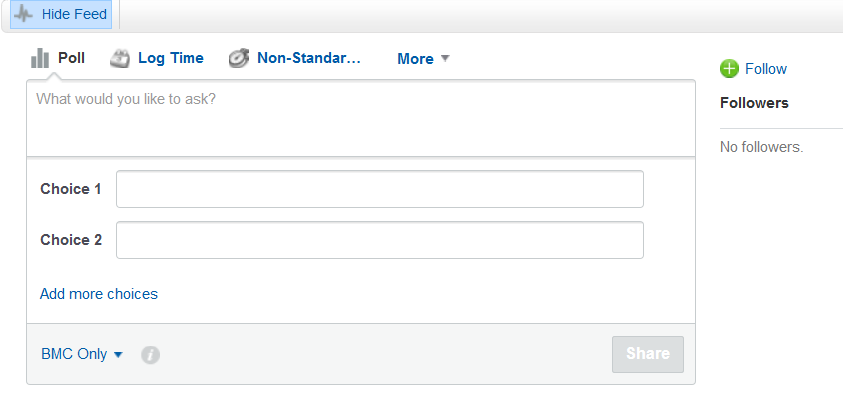

## PreSales General

### MBO Recording Requirements

| Deliverable | SalesForce Type  | Opportunity | SFDC Activity | Sesmic Document | SharePoint Survey | Notes|
|------------|--------------------------------------------|---|--|--|--|--|
|Account Planning SAAP PG activity | ESO PreSales Account Strategy | Client Opportunity or Account | Yes |Yes| | |
|Speaking at Marketing events |ESO PreSales Demand Gen/Pipeline Gen |PreSales Engagement Excellence Tracking (SFDC-510399) |Yes ||Yes | | |
|Support Partner training/enablement |ESO PreSales Partner Enablement |PreSales Engagement Excellence Tracking (SFDC-510399) |Yes || Yes| | |
|Customer Contact Programs activities|ESO PreSales Collaborative Value Review |PreSales Engagement Excellence Tracking (SFDC-510399) |Yes ||Yes |Subject line to start with CCP|
|White Papers/Competitive Docs |ESO PreSales Thought Leadership |PreSales Engagement Excellence Tracking (SFDC-510399) |Yes |Yes |Yes||
|CVCs/Value Cases |ESO PreSales Thought Leadership |PreSales Engagement Excellence Tracking (SFDC-510399) | Yes | Yes| Yes|||
|Surveys |ESO PreSales Administration |PreSales Engagement Excellence Tracking (SFDC-510399) |Yes ||Yes||
|Differentiated CoP content |ESO PreSales Thought Leadership |PreSales Engagement Excellence Tracking (SFDC-510399) |Yes ||||Reported by CoP|
|Sales Play content |ESO PreSales Thought Leadership |PreSales Engagement Excellence Tracking (SFDC-510399) |Yes ||Yes||
|New EED Templates/Innovation around existing templates |ESO PreSales Thought Leadership |PreSales Engagement Excellence Tracking (SFDC-510399) |Yes ||Yes||
|EBC Support/Engagement |ESO PreSales Demand Gen/Pipeline Gen |Client Opportunity or Account |Yes||||
|Enablement / Certification |ESO PreSales Training Participation |PreSales Engagement Excellence Tracking (SFDC-510399) |Yes ||Yes||
|Perspective |ESO PreSales BMC Perspective |Client Opportunity |Yes |Yes|||
|Executive First |ESO PreSales Executive First|Client Opportunity |Yes |Yes|||
|Solution Demo |ESO PreSales Solution Demo |Client Opportunity |Yes||||
|CVRs |ESO PreSales Collaborative Value Review |Client Opportunity |Yes |Yes|||
|Proof of Value |ESO PreSales Proof of Value |Client Opportunity |Yes |Yes|||
|Validated Perspective |ESO PreSales Validated Perspective |Client Opportunity |Yes |Yes|||
|Special Projects |PreSales Engagement Excellence Tracking (SFDC-510399) |Yes ||Yes |SFDC type depends on topic|

### Definitions

|Title | Notes |
|--|--|
|Deliverable |What is being done |
|Salesforce Type |Salesforce Activity type |
|Opportunity |To which concept assign the activity: Client Account or Opportunity or the PreSales tracking opportunity |
|SFDC Activity |SFDC entries are required to capture hours as a task or event. |
|SAVO document |A valid Sales Edge document is needed to receive credit. |
|Sharepoint |PreSales Sharepoint entries are required (see URLs page for additional information)  |

### URLs
[SalesForce](https://bmcapps.my.salesforce.com)  
[Sales Edge (a.k.a. Sesmic)](https://bmc.seismic.com/x5/doccenter.aspx#/home)

Sharepoints:

* [PreSales MBO Submissions](https://bmcsoftware.sharepoint.com/sites/PreSalesCOESite/PreSalesMBOCreditSubmissions/Home%20Page/Home.aspx)
    + Enablement/Certification
    + CEP Support/Engagement
    + New EED Templates/Innovation around existing templates
    + Sales Plays Content
    + Speaking at Marketing Events
    + Special Project
    + Support Partner Training/Enablement
    + Value Cases
    + White Papers/Competitive Docs
    - KPI Credit Discrepancy  

[Surveys](https://bmcsoftware.sharepoint.com/sites/PreSalesCOESite/PreSalesMBOCreditSubmissions/Lists/PreSales%20Internal%20Customer%20Survey/AllItems.aspx)  
[CoP Benchmarks](https://bmcsoftware.sharepoint.com/sites/PreSalesCOESite/Lists/VEB%20Change%20%20Benchmark/AllItems.aspx)  
[PreSales Portal](https://bmc.seismic.com/X5/doccenter.aspx#/home)  
[Enablement @Confluence Home](https://docs.bmc.com/docs/display/NE/Home)  
[Enablement @Confluence BMC Only](https://docs.bmc.com/docs/display/NE/BMC+ONLY)  
[Enablement @Confluence Programs](https://docs.bmc.com/docs/display/NE/Programs)
[Benchmarks](https://bmcsoftware.sharepoint.com/sites/PreSalesCOESite/Lists/VEB%20Change%20%20Benchmark/NewForm.aspx )

### SFDC Activities
All your customer activities need to be recorded **weekly (including EE)**.  All definitely before the end of the month using the correct Opportunity record.  Dashboard information is tied directly to this.
 

### ESO - RFP Request
**Salesforce Classic**  

First go into your salesforce opportunity ID for the project you have received an RFP for.  On the top you will see the following box.  Click the drop down by the word “more”. (make sure your “+show feed” is chosen)

Choose “RFP Request”

**Status** – leave as “new”  
**Due Date** – add the day the response is due to the customer  
**User** – should automatically populate to your name   
**Type** – Choose from the drop down of what your request is:  RFI, RFP, RFQ

**Lightening Version**

First go into your salesforce opportunity ID for the project you have received an RFP for.  On the top right-hand side, you can see an arrow next to SC request.  Click the arrow and select RFP request.

**Status** – leave as “new”  
**Due Date** – add the day the response is due to the customer  
**User** – should automatically populate to your name  
**Type**– Choose from the drop down of what your request is:  RFI, RFP, RFQ  

## MBOs

### MBO Credit - General Information
Now that we have started to create some of our targeted deliverables, we must follow the process set forth by the CoE.  Use the [Sales Edge Presale Portal UPDATE](https://bmc.seismic.com/X5/#/home) to upload your content to the COE.

*** Important note:  Do not submit an artifact to this site until your Manager reviews first.  Managers must ensure 90% readiness prior to BPC assistance ***

The MBO tracking and Credit request page is available [here UPDATE](https://bmcsoftware.gosavo.com/CustomPage/View.aspx?id=40137615)  

In all cases, there are at least two different entries that are required:

* Salesforce to capture time

* SharePoint to capture completion for MBO  Reporting

The necessary Sharepoint lists can be found [here](https://bmcsoftware.sharepoint.com/sites/PreSalesCOESite/PreSalesMBOCreditSubmissions/)

* See PreSales General -> Recording Requirements for a table with recording  

### MBO Credit - Special Project

There are two pieces of information:

1. SalesForce for Time Management

2. SharePoint for MBO Reporting

SalesForce

* Open the PreSales Engagement Excellence Opportunity and add a Task

    * https://bmcapps.my.salesforce.com/0061400001HRsq5
    * SFDC-510399

* Enter the required information

    * Subject as "Special Project - <Your Project Name>"

    * Enter the Type from appropriate ones in the table provided in the General Information tab

MBO Reporting

* Go to the MBO tracking page and click on Special Projects [here](https://bmcsoftware.gosavo.com/CustomPage/View.aspx?id=40137615)
* It will take you to a SharePoint page where you will enter the details of your Special Project
* Enter your information and ensure you click on Finish at the bottom of the page.

### Center of Excellence (CoE) – MBO uploads

Teams,

Now that we have started to create some of our targeted deliverables, we must follow the process set forth by the CoE. Use the [Sales Edge Presale Portal UPDATE](https://bmc.seismic.com/X5/#/home) to upload your content to the COE.  
*** Important note:  Do not submit an artifact to this site until your Manager reviews first.  Managers must ensure 90% readiness prior to BPC assistance ***

### Recording Activities

Switching Activity time to another Opportunity

Using the “Relate To” you can switch your activity time from an Account or Opportunity to another Opportunity easily.  

1. Locate your activity entry

2. If switching from “Account” to “Opportunity”, use the drop down on the “Relate To” record and switch to “Opportunity”.  If going from “Opportunity” to “Opportunity” skip to step 3.
3. Select the “magnify glass” icon and then select the appropriate Opportunity

4. Now “Save”.  Your activity hours should now be reflected on the new Opportunity you’ve selected.

### External Surveys
The Sesmic document is located [here UPDATE](https://bmcsoftware.gosavo.com/Document/Document.aspx?id=48997818&view=)

The Process:

1. Check if your contact recipient is  in the Opt Out list

    * Check the slides in Sales Edge for the latest link to the Opt Out information.

2. Compose the email using the template as a model

    * Check the Sales Edge template in case there were revisions (GDPR, or other regulations notices may be added in the future).  

3. Send it

4. Check the MBO Dashboard to see if the response is recorded.

## Career Management
### The process
1. Enter goals related to the quarter.

    * You may be able to copy them from other quarter (See this page)

    * Enter the description and success criteria

2. Do not mark them complete until they are done, as they cannot be changed

3. When they are completed, submit it to your manager

### Copy Goals from Prior Quarters

1. In case you didn’t know you can select your Q3 goals by using the drop down

2. Then select a KPI (goal) and use the drop down and select copy

3. Next using the drop downs change “Review Period” and “Target Goal period” to Q4.

4. Now you just need to change the success criteria and/or description if needed.

## EEDs
### Perspectives
Perspectives examples can be found on our PreSales Portal in Sales Edge [here UPDATE](https://bmcsoftware.gosavo.com/CustomPage/View.aspx?id=38017393)  
Make sure to record the Perspective in the EE of SFDC.  (i.e, Planned, In Progress, Completed)  
Once at least 90% completed the Perspective must be uploaded to Sales Edge.       
To build an outstanding Perspective, please allow 1 to 3 weeks depending on the complexity of your document.  
To receive credit, the perspective must be on Sales Edge on the general area, and the link copied on the ED record.  
